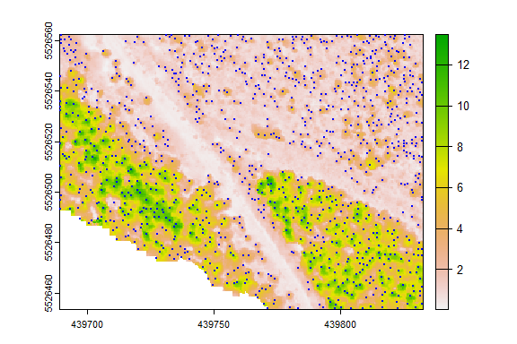
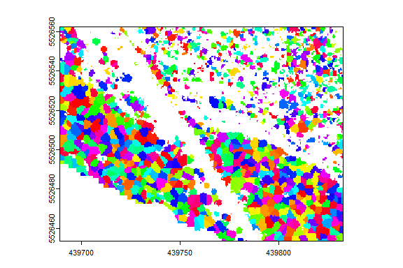

Canopy Analysis in R Using ForestTools
================
Andrew Plowright

This short guide will demonstrate how to use the ForestTools package to
detect and outline trees from a canopy height model (CHM) derived from a
photogrammetric point cloud.

Begin by installing ForestTools.

``` r
install.packages("ForestTools")
```

# Loading sample data

A sample CHM is included in the ForestTools package. It represents a
small 1.5 hectare swath of forest in the Kootenay Mountains, British
Columbia.

``` r
# Attach the 'ForestTools' and 'terra' libraries
library(ForestTools)
library(terra)
library(sf)

# Load sample canopy height model
chm <- terra::rast(kootenayCHM)
```

View the CHM using the `plot` function. The cell values are equal to the
canopy’s height above ground.

``` r
# Remove plot margins (optional)
par(mar = rep(0.5, 4))

# Plot CHM (extra optional arguments remove labels and tick marks from the plot)
plot(chm, xlab = "", ylab = "", xaxt='n', yaxt = 'n')
```

<!-- -->

# Detecting treetops

Dominant treetops can be detected using `vwf`. This function implements
the *variable window filter* algorithm developed by Popescu and Wynne
(2004). In short, a moving window scans the CHM and tags a given cell as
treetop if it is found to be the highest within the window. The size of
the window itself changes dynamically depending on the height of the
cell on which it is centered. This is to account for varying crown
sizes, with tall trees assumed to have wide crowns and vice versa.

Therefore, the first step is to define the **function that will define
the dynamic window size**. Essentially, this function should take a
**CHM cell value** (i.e.: the height of the canopy above ground at that
location) and return the **radius of the search window**. Here, we will
define a simple linear equation, but any function with a single input
and output will work. We do not wish for the `vwf` to tag low-lying
underbrush or other spurious treetops, and so we also set a minimum
height of 2 m using the `minHeight` argument. Any cell with a lower
value will not be tagged as a treetop.

``` r
# Function for defining dynamic window size
lin <- function(x){x * 0.05 + 0.6}

# Detect treetops
ttops <- vwf(chm, winFun = lin, minHeight = 2)
```

We can now plot these treetops on top of the CHM.

``` r
# Plot CHM
plot(chm, xlab = "", ylab = "", xaxt='n', yaxt = 'n')

# Add dominant treetops to the plot
plot(ttops$geometry, col = "blue", pch = 20, cex = 0.5, add = TRUE)
```

<!-- -->

The `ttops` object created by `vwf` in this example contains the spatial
coordinates of each detected treetop, as well as two default attributes:
*height* and *winRadius*. These correspond to the tree’s height above
ground and the radius of the moving window where the tree was located.
Note that *winRadius* **is not necessarily equivalent to the tree’s
crown radius**.

``` r
# Get the mean treetop height
mean(ttops$height)
```

    ## [1] 5.404217

# Outlining tree crowns

Canopy height models often represent continuous, dense forests, where
tree crowns abut against each other. Outlining discrete crown shapes
from this type of forest is often referred to as *canopy segmentation*,
where each crown outline is represented by a *segment*. Once a set of
treetops have been detected from a canopy height model, the `mcws`
function can be used for this purpose.

The `mcws` function implements the `watershed` algorithm from the
[imager](https://cran.r-project.org/package=imager/imager.pdf) library.
Watershed algorithms are frequently used in topographical analysis to
outline drainage basins. Given the morphological similarity between an
inverted canopy and a terrain model, this same process can be used to
outline tree crowns. However, a potential problem is the issue of
*oversegmentation*, whereby branches, bumps and other spurious treetops
are given their own segments. This source of error can be mitigated by
using a variant of the algorithm known as *marker-controlled watershed
segmentation* (Beucher & Meyer, 1993), whereby the watershed algorithm
is constrained by a set of markers – in this case, treetops.

The `mcws` function also takes a `minHeight` argument, although this
value should be lower than that which was assigned to `vwf`. For the
latter, `minHeight` defines the lowest expected treetop, whereas for the
former it should correspond to the height above ground of the fringes of
the lowest trees.

``` r
# Create crown map
crowns_ras <- mcws(treetops = ttops, CHM = chm, minHeight = 1.5)

# Plot crowns
plot(crowns_ras, col = sample(rainbow(50), nrow(unique(chm)), replace = TRUE), legend = FALSE, xlab = "", ylab = "", xaxt='n', yaxt = 'n')
```

<!-- -->

By default, `mcws` returns a raster, where each crown is given a unique
cell value. Depending on the intended purpose of the crown map, it may
be preferable to store these outlines as polygons. This can be
accomplished by setting the `format` argument to “polygons”. As an added
benefit, these polygons will inherit the attributes of the treetops from
which they were generated, such as *height*.

``` r
# Create polygon crown map
crowns_poly <- mcws(treetops = ttops, CHM = chm, format = "polygons", minHeight = 1.5)

# Plot CHM
plot(chm, xlab = "", ylab = "", xaxt='n', yaxt = 'n')

# Add crown outlines to the plot
plot(crowns_poly$geometry, border = "blue", lwd = 0.5, add = TRUE)
```

<!-- -->

Assuming that each crown has a roughly circular shape, we can use the
crown’s area to compute its average circular diameter.

``` r
# Compute area and diameter
crowns_poly[["area"]] <- st_area(crowns_poly)
crowns_poly[["diameter"]] <- sqrt(crowns_poly[["area"]]/ pi) * 2

# Mean crown diameter
mean(crowns_poly$diameter)
```

    ## 2.882985 [m]

# References

Popescu, S. C., & Wynne, R. H. (2004). [Seeing the trees in the
forest](https://www.ingentaconnect.com/content/asprs/pers/2004/00000070/00000005/art00003).
*Photogrammetric Engineering & Remote Sensing, 70*(5), 589-604.

Beucher, S., and Meyer, F. (1993). [The morphological approach to
segmentation: the watershed
transformation](https://www.researchgate.net/profile/Serge-Beucher/publication/233950923_Segmentation_The_Watershed_Transformation_Mathematical_Morphology_in_Image_Processing/links/55f7c6ce08aeba1d9efe4072/Segmentation-The-Watershed-Transformation-Mathematical-Morphology-in-Image-Processing.pdf).
*Mathematical morphology in image processing*, 433-481.
