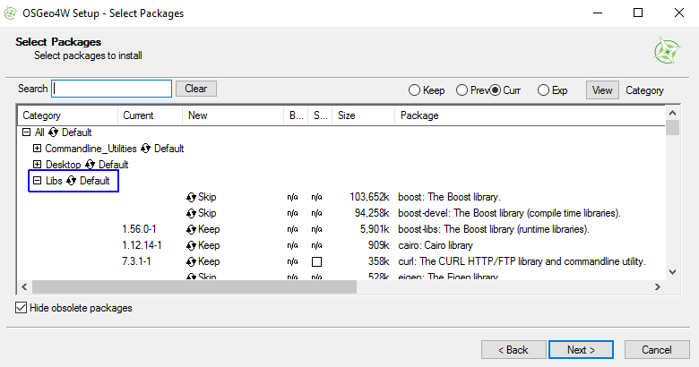
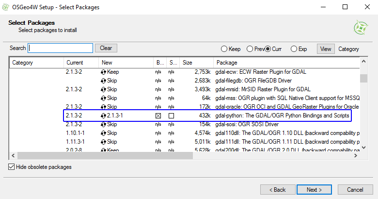

```{r global_options, include=FALSE, dpi =  300}
knitr::opts_knit$set(global.par = TRUE)
options(rmarkdown.html_vignette.check_title = FALSE)
```

```{r setup, include=FALSE}
library(ForestTools)
```

## Issues with _mcws_

Although the `mcws` function computes crown maps as a raster, many users find that having crowns as polygons is more useful for analytical purposes. Therefore, a `format` argument was added which, when set to `format = "polygons"`, makes the function convert the raster map to a set of polygons. As an added benefit, the function also carries over the attributes of the `treetops` argument into the newly created polygons, i.e.: if an input treetop has a _height_ field associated with it, its corresponding crown polygon will also have that same value. The `mcws` function also computes the crowns' horizontal area, which is stored in the output's _crownArea_ field.

However, the underlying function used to convert rasters to polygons is `rasterToPolygons`, from the [raster](https://cran.r-project.org/package=raster) package. This function is problematic due to its slow processing speed and its tendency to leak memory when applied to multiple datasets.

## Using the GDAL library instead

An alternative option is available for users who have installed [OSGeo for Windows](https://trac.osgeo.org/osgeo4w/). OSGeo4W is a suite of free open source geospatial software, such as GDAL, GRASS and QGIS. In particular, it contains the  _gdal\_polygonize.py_ GDAL utility, which performs the same function as `rasterToPolygons` but with a much better performance.

John Baumgartner and Francisco Rodriguez-Sanchez [developed a script](https://johnbaumgartner.wordpress.com/2012/07/26/getting-rasters-into-shape-from-r/) to run the _gdal\_polygonize.py_ utility from R. This solution has been integrated into the `mcws` function.

## Installation

First, ensure that the `APfun` library (on which the `ForestTools` is dependent) is up-to-date (it should be **version 0.1.1** at a minimum).

```{r, eval = FALSE}
update.packages()

packageVersion("APfun")
```

The GDAL utility requires three things to be installed:

* The OSGeo4W Shell
* Python
* The GDAL/OGR Python bindings and scripts

All three can be installed simultaneously by downloading the [OSGeo4W installer](https://trac.osgeo.org/osgeo4w/). Once the installer is downloaded, select either **Express Desktop Install** or **Advanced Install**.

Selecting **Express Desktop Install** is recommended, and will install the standard suite of OSGeo software (including everything needed here). However, to select only the required components for running _gdal\_polygonize.py_ utility, follow these steps:

1. Select **Advanced Install**
2. Go through the next six menus, selecting whichever installation options are appropriate for your system.
3. Once you reach the **Select Packages** menu, open the _Libs_ dropdown category.



4. Scroll down and select the _gdal-python: The GDAL/OGR Python Bindings and Scripts_ package.



5. Click **Next**. The next menu will display other packages that must be installed along with _gdal-python_. Accept these and continue with the installation.

## Usage

Once OSGeo4W has been installed, the only new argument that must be defined when using `mcws` is `OSGeoPath`, the path to the OSGeo4W installation directory. By default, the path for the 64-bit version of OSGeo4W is 'C:\\OSGeo4W64'. Simply add this parameter to `mcws`, and the function will use the GDAL library for computing crown polygons.

This should significantly improve processing speeds and resolve memory leak issues from earlier version.

```{r, eval = FALSE}
library(ForestTools)

data("kootenayCHM")
data("kootenayTrees")

kootenayCrowns <- mcws(kootenayTrees, kootenayCHM, minHeight = 1.5, format = "polygons", OSGeoPath = "C:\\OSGeo4W64")
```


